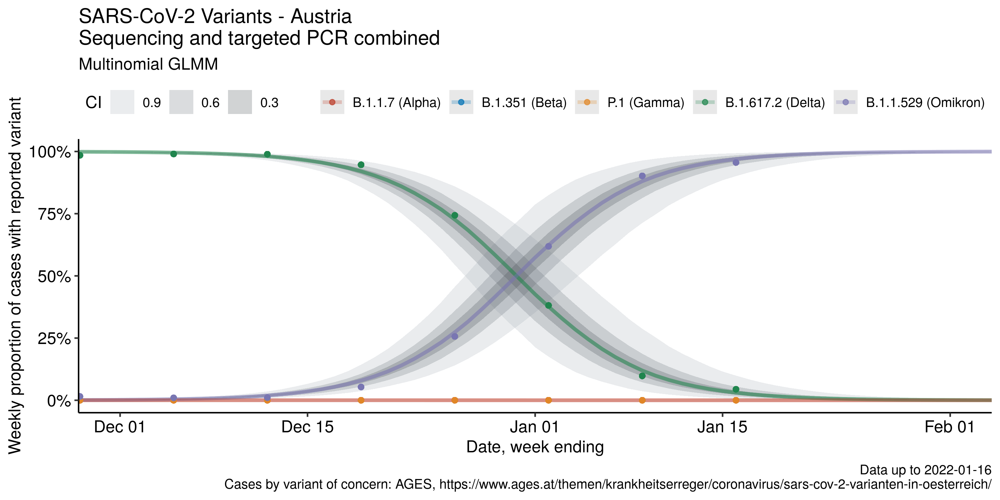

# covid19-austria-omicron

Collection of various models for estimating the growth advantage and 
spread of the Omicron (B.1.1.529) COVID-19 variant in Austria. 

## Bayesian Multinomial GLMM

A Bayesian multinomial GLMM is fitted to the variant of concern data from Austria 
for estimating the growth advantage of Omicron (B.1.1.529) over Delta (B.1.617.2).
Currently the Delta, Omicron and Alpha variants of concern are included in the GLMM, 
since cases of those variants were reported in the investigated period. 

A weekly random effect is used in the GLMM to account for overdispersion in 
weekly case data. 

For reasoning behind this choice please see:
[Harrison, X. A. Using observation-level random effects to model overdispersion in count data in ecology and evolution. PeerJ 2, e616 (2014).](https://peerj.com/articles/616/).

The Bayesian multinomial GLMM is implemented using [brms](https://github.com/paul-buerkner/brms).

Model sources can be found in [/R/functions/model/multinomial_models.R](/R/functions/model/multinomial_models.R).

Fit of the multionmial GLMM to variants in Austria. 





## Build 

This project uses the [renv](https://rstudio.github.io/renv/articles/renv.html) 
and [targets](https://books.ropensci.org/targets/) R packages for reproducible
research. 

First you need to install [renv](https://rstudio.github.io/renv/articles/renv.html) 
and then install all required R packages using
```r
renv::restore()
```

The whole project can then be built using [targets](https://books.ropensci.org/targets/)
by just calling 
```r
tar_make()
```

Full locally parallelized build using targets futures is also supported using 
for example
```r
tar_make_future(workers=8)
```

## Data Sources

Variant of concern cases identified using variant specific PCR or sequencing 
are loaded from the weekly case data published by AGES.

[SARS-CoV-2-Varianten in Österreich](https://www.ages.at/themen/krankheitserreger/coronavirus/sars-cov-2-varianten-in-oesterreich/)
